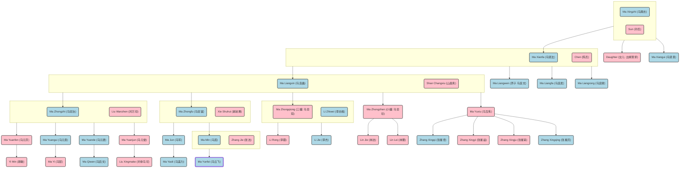

```mermaid
graph TD
    %% 第一代
    MaXingzhi("Ma Xingzhi (马興志)")
    SunShi("Sun (孙氏)")
    Daughter("Daughter (女儿: 出嫁萧家)")
    

    %% 第二代
    MaXianfa("Ma Xianfa (马贤法)")
    MaXiangui("Ma Xiangui (马贤贵)")
    ChenShi("Chen (陈氏)")
    YangZiLiangwen("Ma Liangwen (养子 马良文)")
    LiangXin("Ma Liangxin (马良鑫)")
    LiangFa("Ma Liangfa (马良发)")
    LiangRong("Ma Liangrong (马良榮)")

    %% 第三代
    ShanChangxiu("Shan Changxiu (山昌秀)")
    MaZhongzhi("Ma Zhongzhi (马忠治)")

    %% 第四代
    LiuWanzhen("Liu Wanzhen (刘万珍)")
    ErShuMaZhongfu("Ma Zhongfu (马忠富)")
    SanNianMaZhongqiong("Ma Zhongqiong (三嬢: 马忠琼)")
    XiaoNianMaZhongzhen("Ma Zhongzhen (小嬢: 马忠珍)")
    YuanFen("Ma Yuanfen (马元芬)")
    YuanGui("Ma Yuangui (马元贵)")
    YuanDe("Ma Yuande (马元德)")
    YuanJun("Ma Yuanjun (马元俊)")

    %% 二叔的子女
    XieShuhui("Xie Shuhui (谢淑惠)")
    MaJun("Ma Jun (马军)")
    MaMin("Ma Min (马民)")

    %% 三嬢的子女
    LiZhiwei("Li Zhiwei (李志维)")
    LiRong("Li Rong (李蓉)")
    LiJie("Li Jie (李杰)")

    %% 小嬢的子女
    LinJie("Lin Jie (林洁)")
    LinLei("Lin Lei (林蕾)")

    %% 元贵、元德、元俊的子女
    MaYi("Ma Yi (马懿)")
    MaQiwen("Ma Qiwen (马启文)")
    LiuXingMaKe("Liu Xingmake (刘幸马可)")

    %% 其他子女
    MaYuxiu("Ma Yuxiu (马玉秀)")
    ZhangXingqi("Zhang Xingqi (张星奇)")
    ZhangXingyi("Zhang Xingyi (张星益)")
    ZhangXingju("Zhang Xingju (张星菊)")
    ZhangXingqing("Zhang Xingqing (张星庆)")
    YiMin("Yi Min (易敏)")
    MaYaoli("Ma Yaoli (马遥力)")
    MaYunfei("Ma Yunfei (马云飞)")
    ZhangJie("Zhang Jie (张洁)")

%% -- Relationships --

subgraph MaxingzhiFamily[" "]
    direction LR
    MaXingzhi
    SunShi
end

subgraph MaXianfaFamily[" "]
    MaXianfa
    ChenShi
end

subgraph MaliangxinFamily[" "]
    LiangXin
    ShanChangxiu
end

subgraph MaZhongzhiFamily[" "]
    MaZhongzhi
    LiuWanzhen
end

subgraph ErShuMaZhongfuFamily[" "]
    ErShuMaZhongfu
    XieShuhui
end

subgraph MaMinFamily[" "]
    MaMin
    ZhangJie
end

subgraph MaZhongqiongFamily[" "]
    SanNianMaZhongqiong
    LiZhiwei
end


MaxingzhiFamily --> MaXianfa & MaXiangui & Daughter

MaXianfaFamily --> YangZiLiangwen & LiangXin & LiangFa & LiangRong

MaliangxinFamily --> MaZhongzhi & MaYuxiu & ErShuMaZhongfu & SanNianMaZhongqiong & XiaoNianMaZhongzhen

MaZhongzhiFamily --> YuanFen & YuanGui & YuanDe & YuanJun

YuanFen --> YiMin

YuanGui --> MaYi

YuanDe --> MaQiwen

YuanJun --> LiuXingMaKe

MaYuxiu --> ZhangXingqi & ZhangXingyi & ZhangXingju & ZhangXingqing

ErShuMaZhongfuFamily --> MaJun & MaMin

MaMinFamily --> MaYunfei 

MaJun --> MaYaoli

MaZhongqiongFamily --> LiRong & LiJie

XiaoNianMaZhongzhen --> LinJie & LinLei


%% -- Styles --

%% Style male node (e.g., blue for male)
style MaXingzhi fill:#ADD8E6,stroke:#333,stroke-width:2px
style MaXianfa fill:#ADD8E6,stroke:#333,stroke-width:2px
style MaXiangui fill:#ADD8E6,stroke:#333,stroke-width:2px
style YangZiLiangwen fill:#ADD8E6,stroke:#333,stroke-width:2px
style LiangXin fill:#ADD8E6,stroke:#333,stroke-width:2px
style LiangFa fill:#ADD8E6,stroke:#333,stroke-width:2px
style LiangRong fill:#ADD8E6,stroke:#333,stroke-width:2px

style MaZhongzhi fill:#ADD8E6,stroke:#333,stroke-width:2px
style ErShuMaZhongfu fill:#ADD8E6,stroke:#333,stroke-width:2px
style YuanGui fill:#ADD8E6,stroke:#333,stroke-width:2px
style YuanDe fill:#ADD8E6,stroke:#333,stroke-width:2px
style MaJun fill:#ADD8E6,stroke:#333,stroke-width:2px
style MaMin fill:#ADD8E6,stroke:#333,stroke-width:2px
style LiZhiwei fill:#ADD8E6,stroke:#333,stroke-width:2px
style LiJie fill:#ADD8E6,stroke:#333,stroke-width:2px
style MaQiwen fill:#ADD8E6,stroke:#333,stroke-width:2px
style ZhangXingqi fill:#ADD8E6,stroke:#333,stroke-width:2px
style ZhangXingqing fill:#ADD8E6,stroke:#333,stroke-width:2px


style MaYaoli fill:#ADD8E6,stroke:#333,stroke-width:2px
style MaYunfei fill:#ADD8E6,stroke:#33,stroke-width:5px


%% Style female node (e.g., pink for female)
style SunShi fill:#FFC0CB,stroke:#333,stroke-width:2px
style Daughter fill:#FFC0CB,stroke:#333,stroke-width:2px
style ChenShi fill:#FFC0CB,stroke:#333,stroke-width:2px
style ShanChangxiu fill:#FFC0CB,stroke:#333,stroke-width:2px
style LiuWanzhen fill:#FFC0CB,stroke:#333,stroke-width:2px
style SanNianMaZhongqiong fill:#FFC0CB,stroke:#333,stroke-width:2px
style XiaoNianMaZhongzhen fill:#FFC0CB,stroke:#333,stroke-width:2px
style YuanFen fill:#FFC0CB,stroke:#333,stroke-width:2px
style YuanJun fill:#FFC0CB,stroke:#333,stroke-width:2px
style XieShuhui fill:#FFC0CB,stroke:#333,stroke-width:2px
style LiRong fill:#FFC0CB,stroke:#333,stroke-width:2px
style LinJie fill:#FFC0CB,stroke:#333,stroke-width:2px
style LinLei fill:#FFC0CB,stroke:#333,stroke-width:2px
style MaYi fill:#FFC0CB,stroke:#333,stroke-width:2px
style LiuXingMaKe fill:#FFC0CB,stroke:#333,stroke-width:2px
style MaYuxiu fill:#FFC0CB,stroke:#333,stroke-width:2px
style ZhangXingyi fill:#FFC0CB,stroke:#333,stroke-width:2px
style ZhangXingju fill:#FFC0CB,stroke:#333,stroke-width:2px
style YiMin fill:#FFC0CB,stroke:#333,stroke-width:2px

style ZhangJie fill:#FFC0CB,stroke:#333,stroke-width:2px
```