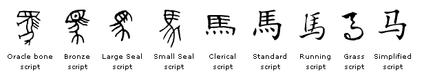

**Yunfei** (first name) **Ma** (last name), or Ma Yunfei, is written in Chinese characters as 马云飞.

- 马 (Mǎ) means ["horse"](https://depts.washington.edu/triolive/quest/2007/TTQ07030/horse.html), a symbol of speed and freedom. It is 13th most common surname in mainland China.
- 云 (Yún) means ["cloud"](https://en.wikipedia.org/wiki/Xiangyun_(Auspicious_clouds)), representing elevation, flexibility, and a sense of dreaminess. It symbolizes happiness and good luck.
- 飞 (Fēi) means "to fly," symbolizing the aspiration to transcend limitations and pursue dreams, embodying freedom and enlightenment.

When combined, 马云飞 (Mǎ Yún Fēi) can be interpreted as a poetic expression of ambition, freedom, and the pursuit of dreams beyond the ordinary. The name conjures images of a horse soaring through the clouds, a metaphor for an individual who strives to transcend limitations and achieve great heights. It reflects a dynamic and ambitious spirit, aligned with traditional Chinese values of perseverance, aspiration, and the harmonious balance between heaven and earth.

*The image above was generated by DALL·E.*

*The [evolution of the character](https://www.omniglot.com/chinese/horse.htm) 马*

