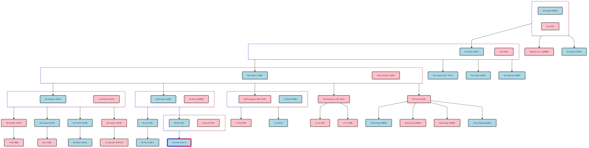

This text is a biography of the Ma family, compiled in 1983, and it provides a detailed account of my family's history and struggles in Sichuan, China. Starting with the late Ming and early Qing dynasties, the text recounts the family's hardship, poverty, and resilience in the face of various societal changes, including war, migration, and political upheaval. It chronicles the lives of the family members, highlighting their individual struggles and achievements, emphasizing their strong family bonds and their dedication to their family's prosperity. The biography also provides a glimpse into the social and economic changes experienced in China during the first half of the 20th century, from the decline of the old society to the emergence of a socialist system.

You can also listen to the short [Podcast: Biography of the Ma Family](https://spotifyanchor-web.app.link/e/fZOzvBZ1FNb) generate by NodebookLM. 

    

        <h2>English Translation</h2>
    <head>
    <meta charset="UTF-8">
    <meta name="viewport" content="width=device-width, initial-scale=1.0">
    <title>Foreword</title>
    
</head>
<body>

    <!-- Title Section -->
<h1>Biography of the Ma Family</h1>
    
Year 1983

    
Compiled by Zhi(治)

    
March

    
Biography of the Ma Family

    
Family Biography of the Ma Clan

    <!-- Section 1: Introduction -->
<section>
    <h2>Preface</h2>
    
The Ma family originates from Huguang (湖廣), Xiaogan (孝感鄉) in Macheng County (麻城县). During the late Ming and early Qing dynasties, wars and invasions caused devastation, and the population of Shu (蜀) was drastically reduced. The Qing government implemented a large-scale migration policy, and thus our ancestors moved to Sichuan (四川). At that time, the entire clan settled in Sanduiba (三堆坝), Xinfan County (新繁县), where they made a living. Later, due to the hardships of life, the family dispersed and relocated to various places.

</section>

<!-- Section 2: Great-Grandfather -->
<section>
    <h2>1. Great-Great-Grandfather Ma Xingzhi (马興志)</h2>
    

    Great-grandfather, unable to make a living in his hometown as a young man, sought refuge with his brother-in-law’s family, the Li’s (李家), in Peng County (彭县). Living under their roof, he struggled to survive. Later, he built a straw hut behind Longyu Temple (隆舆寺). Despite working hard as a laborer daily, life remained difficult. Facing the threats of hunger and cold, he sought another way to make a living. Thanks to financial help from the Li family, he was able to rent land at Caishen Temple (财神庙) on Taiping Street (太平街) and set up a modest home with two rooms and basic furniture. Gradually, life improved, and he started a sedan-chair business (轿房). Great-grandfather married Sun (孙氏) and had two sons and one daughter: Ma Xianfa (马贤法), Ma Xiangui (马贤贵), and the daughter married into the Xiao family (萧家, Xiao Zhengbang 肖正邦). Great-grandfather’s younger son, Ma Xiangui, left to seek fortune elsewhere and never returned. Great-grandfather later passed away by suicide, hanging himself due to the overwhelming burdens of poverty and sickness. Afterward, his wife remarried into the Xu family (徐家) at Aochang (敖场). These events paint a tragic picture of the family’s suffering.
    

</section>

<!-- Section 3: Great-Grandmother -->
<section>
    <h2>2.Great-Grandfather Ma Xianfa (马贤法) and Great-Grandmother Chen (陈氏)</h2>
    
The Ma family was on the verge of extinction, but thanks to the wisdom, diligence, and perseverance of Great-Grandmother (陈氏), the family was able to survive. She was a pillar of strength, and through her hard work, the family eventually prospered. She had four sons: the adopted eldest son Liangwen (良文), and the younger sons Liangxin (良鑫), Liangfa (良发), and Liangrong (良荣). She made an immense contribution to the Ma family, ensuring its survival and laying a foundation for future generations.
    

    

    Through the tireless efforts of Great-Grandfather Ma Xianfa (马贤法), Great-Grandmother Chen (陈氏), and Grandfather’s generation, the family accumulated wealth over 20 years. In 1937, Great-Grandfather Ma Xianfa passed away at the age of 60, and in 1938, Great-Grandmother Chen oversaw the division of family property, including 44 acres of land near the border of Shi-Peng (什彭). Each of the four brothers received eight acres, while Great-Grandmother Chen kept 12 acres for her own support. The house, consisting of 10 rooms (including the sedan-chair shop), was divided among the brothers, with the sedan-chair shop rotating management every three years.
    

    

    Note: On Hualu Street (铧炉街), four rooms were rented out to Qiu Fushui (邱福水), Xie Pengguang (谢朋光), and Zhao Youchun (赵由春). After the liberation, these rooms were requisitioned by the government. Within the courtyard, there were three tiled rooms, which were later occupied by us after moving, and one thatched room, which was eventually demolished.
    

</section>

<!-- Section 4: -->
<section>
    <h2>3. Grandfather Ma Liangxin (马良鑫)</h2>
    
Grandfather Ma Liangxin (马良鑫) first managed the sedan-chair business for three years before passing it on. In the winter of 1942, the family moved to Hualu Street (铧炉街) and lived temporarily in Great-Grandmother Chen’s retirement house. To support the family, Grandfather Ma Liangxin saved money for three years and purchased a house in Hengjiezi (横街子), outside the north gate of Peng County, to sell alcohol. However, disputes arose with the previous tenants, which were settled by the court, delaying the move by a year. With no other options, Grandfather tried his hand at cloth trading, but his illness worsened, and he was forced to abandon the business, leaving the family to survive on their dwindling savings.
    

</section>

<!-- Section 5: -->
<section>
    <h2> 4. Grandmother Shan Changxiu (山昌秀)</h2>
    
Grandmother Shan Changxiu (山昌秀) was originally from Shanjia Village (山家沟) in Hongyan Township (红岩乡), Peng County (彭县). Her grandfather, Shan Baoshu (山宝书), belonged to a prominent, well-respected family, known for its scholarly achievements. However, the family’s fortunes declined due to later generations, and by the time Grandmother Shan was born, the family was nearly bankrupt. Her father, Shan Huilin (山惠林), squandered the family wealth, and passed away shortly after, leaving Grandmother and her mother alone to fend for themselves. They endured significant mistreatment at the hands of other family members. Before Grandmother Shan could marry, her mother also passed away, leaving her to be raised by her aunt until she married into the Ma family.In the old society, a daughter-in-law not only had to bear children and take care of household duties but also often faced physical and emotional abuse from her in-laws and husband. Great-Grandmother (曾祖母) was harsh, and Grandfather (祖父) had a volatile temper. Before Father (父親) was born, there was even an incident where Grandmother Shan, unable to bear the constant beatings and insults, attempted to take her own life. Even after the family was divided and up until Grandfather’s death, Grandmother Shan frequently faced verbal abuse and mistreatment.The saying, “A daughter-in-law who endures long enough becomes a mother-in-law” (“千年媳妇熬成婆”) encapsulates how arduous the journey from being a daughter-in-law to becoming the matriarch was. The word “endure” in this context contains countless tales of hardship and suffering.
    

    

    Grandmother Shan (山昌秀) was the epitome of a traditional woman of her time—resourceful, industrious, and skilled in every aspect of household management, including sewing and embroidery. There was nothing she didn’t know when it came to running a household efficiently. Her contributions to the prosperity of the family and the success of her children were immense: her achievements were significant, and her virtue was profound. However, the loss of her mother and father at a young age, followed by the death of her husband in middle age, meant that she endured great hardship and struggles for most of her life. Despite these adversities, Grandmother was fortunate in having filial children who showed her deep respect and care, allowing her to enjoy a peaceful and happy old age. As she reflected on her past, looking back at the difficulties she had overcome, one could imagine that she felt the bitterness of her life finally giving way to sweetness.
    

</section>

<!-- Section 6: -->
<section>
    <h2>5. Running the Alcohol Business</h2>
    
In 1943, the family house was finally recovered, but by that time, the family’s savings were nearly depleted. Starting the alcohol business proved difficult due to a lack of working capital. Grandfather Ma Liangxin (马良鑫) had to borrow less than ten stone (石) of rice to scrape together the funds needed to open the tavern. Once the tavern opened, business was relatively good, but Grandfather’s health was in serious decline. He could only provide guidance and make basic arrangements, leaving the majority of the daily management and operations to Father, who was only 14 years old at the time. Shortly before Grandfather’s death, he was bedridden for over 100 days and unable to leave the house. During this time, Father took full responsibility for running the business—working in the tavern during the day and guarding the store at night. After three years of painstaking effort from both Grandfather and Father, the family’s capital had grown from the initial ten stone of rice to between thirty and forty stone, in addition to covering the family’s living expenses. This laid a solid foundation for Father’s future management of the business.
    

</section>

<!-- Section 7: -->
<section>
    <h2>6. A Sudden Calamity</h2>
    

    In May 1947, Grandfather Ma Liangxin (马良鑫) suddenly passed away at the age of 36. At that time, Grandmother Shan Changxiu (山昌秀) was 37 years old. Note: Father (马忠治) was 17, the eldest daughter (大嬢) was 12, the second daughter (二嬢) was 8, the second uncle (二叔) was not yet 6, the third daughter (三嬢) was 3, and the youngest daughter (小嬢) was only 6 months old.
    

    

    The family was struck by immense grief, as if a great tree had been felled by a storm. Grandmother bore the pain of losing her husband in middle age, Father suffered the sorrow of losing his father just as he reached manhood, and the youngest daughter lost the nurturing care she so desperately needed. At the time, Third Aunt (三婆婆, referring to Ma Liangfa’s wife, Li Shi 李氏) remarked, “The old are old, the young are young—how will this large family survive?” This statement highlights the dire situation the family faced. Their family estate was limited, and they could not simply live off their assets. With young children and little means, who would take over the family’s affairs? After Grandfather’s funeral, to ensure the survival of the Ma family and prevent the family from breaking apart, 17-year-old Father took on the heavy responsibility of managing the household during this critical time of crisis. Father fully assumed responsibility for the family’s business and finances, while Grandmother worked diligently at home, managing household affairs. As the saying goes, “Prosperity or decline depends not just on fate, but also on human effort.” If the children had not been filial or the mother had not been virtuous, the Ma family line would likely have been lost forever.
    

</section>

<!-- Section 8: -->
<section>
    <h2>7. Father Ma Zhongzhi (马忠治)</h2>
    

    Between 1947 and early 1950, Father Ma Zhongzhi (马忠治) managed the family business for three years before the liberation of China. The transition from three thousand years of feudalism to a new society where the people became the masters of their own destiny was a time of great upheaval. During the final years before liberation, prices were unstable, and market conditions changed dramatically from day to day. Nevertheless, thanks to Father’s diligent efforts and guidance from older family friends, the family’s tavern business ran relatively smoothly. By the time business was scaled back, the family had accumulated over 100 stone (石) of goods, which could be converted into more than 1,000 yuan (大洋). A year before liberation, Father even used more than 20 stone of rice to purchase a house in Niushiba (牛市坝), which was later requisitioned by the government after the liberation.
    

    

    Before liberation, running a business was fraught with challenges. Competitors constantly sought to undermine each other, and there was relentless competition for profits. Coupled with the devaluation of the Kuomintang currency and skyrocketing prices, the old society followed the law of “the big fish eat the small fish, and the small fish eat the shrimp.” Many people became rich in a short time, but just as many saw their businesses collapse overnight. As the saying goes, “The mantis stalks the cicada, unaware of the oriole behind it” (螳螂捕蝉，焉知黄雀在后), which perfectly describes the precarious situation.For small businesses like ours, there was always the danger of losing everything overnight. On top of that, we had to deal with local bullies, corrupt officials, and rogue soldiers who harassed the family. They would eat at the tavern under the pretense of running a tab, but in reality, they never intended to pay. Sometimes, they even caused trouble for no reason, behaving however they pleased, and we were often subjected to insults and beatings in the very place we worked. Taverns were known as places of frequent disputes (“茶房酒肆”口角之地). To keep the family afloat, Father had no choice but to endure the humiliation—he swallowed his anger, forced a smile, and never dared to show his frustration.Father used to say that he had “rolled” his way out of the old society. The word “roll” (滚) here carries profound meaning. It encapsulates a lifetime of unspeakable hardships, frustrations, and bitter struggles that he endured but rarely spoke of.
    

    

    In 1952, the “Five-Anti” Movement (“五反”运动) was launched to educate private industrial and commercial business owners about socialism. This was also part of the efforts to reform the private economy and guide it toward the socialist path. However, the economic conditions of the time caused business to slump after the movement, and the family’s income was meager. With eight members in the household, it became increasingly difficult to make ends meet, and the family faced financial strain. They had no choice but to use their savings to cover their expenses.
    

    

    Note: The household included Grandmother (祖母), Father (父親), Mother (母親), Second Uncle (二叔), Third Daughter (三嬢), Youngest Daughter (小嬢), Yuanfen (元芬), and Maternal Uncle (表爷).
    

    

    In 1953, the Party proposed the General Line for the Transition Period (过渡时期的总路线), which pushed forward the socialist transformation of private industry and commerce. This culminated in the public-private partnership movement (公私合营) of 1956. Many business owners, including those like Father, who had survived from the old society, were swept up in this whirlwind of change. They struggled and adapted, learning to reform their views and understand the new social order, striving to become “new men.” How exactly Father navigated this period, we do not know for certain, but we can imagine the difficulties he faced.
    

    

    Then came the “Three Years of Difficulty” (三年困难时期) from 1959 to 1961, during which Father, who had never done heavy manual labor, was sent to the mountains to dig coal. This was extremely arduous work, but Father persevered. Despite the hardship, Father did not prioritize his own well-being at the expense of his family. He could have avoided the assignment, but instead, he chose to give the family’s limited savings to those remaining at home, ensuring that the family did not suffer from hunger or cold.Looking back at the hardships that began with Grandfather’s death, no matter how tough the times were, Father always ensured that the elderly were cared for, the young were raised, and everyone was fed and clothed. He encouraged Second Uncle to resume his studies and did everything he could to support Third Daughter (三嬢) and Youngest Daughter (小嬢) in continuing their education.
    

    

    Father deeply regretted the misfortune of being forced to leave school when he was young, so after liberation, he placed great importance on self-education. From 1951 to 1953, he devoted himself to practicing calligraphy and reading various books, greatly expanding his knowledge in many areas. His dedication to learning and self-improvement has continued to this day.
    

</section>

<!-- Section 8.5: -->
<section>
    <h2>8. Mother Liu Wanzhen (刘万珍)</h2>
    

    Mother Liu Wanzhen (刘万珍) was originally from Baihe Township (白鹤乡) in Guanghan County (廣汉县). When she was around two years old, her father, Liu Qinglin (刘清霖), along with her grand-uncle, Liu Tongzhi (刘通之), came to Peng County (彭县) to trade. Eventually, the entire family relocated and settled in Peng County. Her father first opened a tofu restaurant (豆花饭馆), and later expanded into selling oil, rice, and various grains.Mother married Father in the winter of 1949. Coming from a family that relied on self-sufficiency, she learned skills such as weaving and making straw shoes during her childhood, and she cultivated the virtues of thrift, simplicity, and a gentle character. After the liberation, when the family’s economic situation became difficult, she wove cloth and made straw shoes at home to help supplement the household income. In 1955, she worked at a gravel station, and later she participated in the construction of a hydropower station at Zipingba (紫坪坝) in Guan County (灌县). In 1958, with the public-private partnership movement, she joined the workforce and worked until her retirement in March 1982.Mother was deeply respectful of Grandmother and always maintained harmony within the family. She shouldered heavy household responsibilities, and in raising and educating her children, she was both strict and loving. She dedicated herself to the family, rising early and working late, pouring her heart and soul into caring for us throughout her life. Truly, she exemplified the saying, “Sincerity lies in kindness, and virtue rests in compassion” (忠厚存心，仁慈为德). Mother gave everything to ensure the happiness of her children and the harmony of our family.
    

</section>

<!-- Section 9: -->
<section>
    <h2>9. Second Uncle Ma Zhongfu (马忠富)</h2>
    

    Second Uncle Ma Zhongfu (马忠富) graduated from junior high school in the fall of 1957. Father (马忠治) advised him to stay home, review his studies, and take the high school entrance exam the following year. However, Second Uncle wanted to find a job immediately to help reduce the family’s financial burden. Around that time, the state was recruiting students to study traditional Chinese medicine, so he applied and was accepted to study at Xingxin Town Hospital (兴新镇, also known as Haiwozi 海窝子). Afterward, he transferred to Peng County Health School (彭县卫校) and, upon graduation, worked at Peng County People’s Hospital (彭县人民医院) until September 1962, when the government streamlined its institutions and reassigned personnel. He was transferred to the Peng County Pharmaceutical Company (彭县医药公司), where he worked for a year until September 1963, when the government began recruiting for the army. He enlisted and was assigned to serve in Tibet, where he stayed until his discharge and return home in 1968.
    

    

    Tibet’s high-altitude plateau was bitterly cold, with harsh weather and sparse populations. The living conditions were poor, but Second Uncle was able to endure the hardships. He was diligent, hardworking, and dedicated to learning, strictly adhering to discipline. He was repeatedly recognized as a “Five Good Soldier” (五好战士) and received commendations from his superiors. Although his issue with joining the Party organization was not resolved, this was due to the objective circumstances of the time. His five years of service in Tibet tempered his political and ideological maturity, laying a strong foundation for his future career advancement. After returning to his original unit, Second Uncle continued to work, and in 1973, he was transferred to the Commercial Bureau (商业局), where he became a cadre. When he first returned from military service, it was during a period of social unrest (the Cultural Revolution), when improper practices were rampant, and everything depended on personal connections. This was also the time when my siblings and I were due to go to the countryside or find jobs, and we were all searching for a path forward in life. Father, being upright and unyielding, was not skilled in handling external affairs, which caused him constant worry and sleepless nights. Fortunately, Second Uncle took on the burden, using his connections and efforts to help resolve some significant issues. Thanks to his intervention, my siblings and I were able to smoothly secure jobs. This is something we will always remember and never forget for the rest of our lives.
    

</section>

<!-- Section 11: -->
<section>
    <h2>10. Third Aunt Ma Zhongqiong (马忠琼)</h2>
    
Third Aunt Ma Zhongqiong (马忠琼) graduated from primary school in 1957 but did not pass the entrance exam for middle school, so she stayed home to review her studies. Later, she attended a supplemental class organized by the Residents’ Committee on Yanxiu Street (延秀街居委会). In 1958, when Father (马忠治) joined the public-private partnership (公私合营), the family was still comprised of eight people (Grandmother, Father, Mother, Third Aunt, Youngest Aunt, Yuanfen, Yuangui, and Yuande), and Father’s monthly wage was only 22.50 yuan, while Mother’s was 15.00 yuan. These meager wages were not enough to support the family. Father submitted an application requesting that Third Aunt be arranged as a worker. After the application, the family waited for a notice, and Father came home saying that Grandmother told Third Aunt that she would be notified about starting work in a few days.At that time, Third Aunt was still young, and when she heard about the prospect of working in the food service industry, she wasn’t interested and became silent. Grandmother conveyed this to Father, who responded, “If she doesn’t want to go, that’s fine; let her wait until something more suitable comes up.” As a result, Third Aunt waited until the autumn of 1959, when the grain collection began, and she was assigned as a temporary worker at the Mengyang Warehouse (濛阳仓库) by the Peng County Grain Bureau (彭县粮食局). Her performance at work was commendable, and after the grain collection ended, many of the temporary workers returned home, but Third Aunt was asked to stay on. After working for a year, she was sent by the Peng County Grain Bureau to study at the Financial and Trade School (财贸校) in Wenjiang District (温江地区) in the fall of 1960. In early 1962, she was officially assigned to work at the Wenjiang District Grain Bureau (温江地区粮食局). This marked her formal entry into the workforce.Third Aunt possessed many admirable qualities: she was hardworking, eager to learn, had strong moral character, and was cooperative and helpful to her colleagues. As a result, she experienced a smooth career progression. She joined the Party at the young age of 31, a testament to her outstanding achievements as a young adult.
    

    

    Even after her financial situation improved, Third Aunt never forgot the family’s struggles. After her salary was increased in 1963, she sent around ten yuan home each month, which Grandmother used to help with household expenses. She continued this practice until around 1968. Third Aunt always showed great care and concern for us siblings, treating her nieces and nephews with kindness. She upheld a strict approach to education but was always generous in providing for our daily needs. When my elder sister visited her, she would buy her clothes, and when my younger sister went, she would buy fabric for her. When I visited, she graciously hosted me and even spent money to provide meals for my classmates. Third Aunt was incredibly generous with us but very frugal with herself, showing a noble character that we can all learn from.
    

    

    When I visited, she graciously hosted me and even spent money to provide meals for my classmates. Third Aunt was incredibly generous with us but very frugal with herself, showing a noble character that we can all learn from.
    

</section>

<!-- Section 12: -->
<section>
    <h2>11. Youngest Aunt Ma Zhongzhen (马忠珍)</h2>
    
Youngest Aunt Ma Zhongzhen (马忠珍) graduated from primary school in 1960 but did not pass the entrance exam for middle school, so she stayed home to review her studies. Later, she attended a privately-run middle school on Liren Street (里仁街), but after another attempt at the middle school entrance exam, she still was not admitted. As a result, she remained at home for five years, until 1965. At that time, Second Uncle (二叔) was serving in the military, and Third Aunt (三嬢) was working outside the home. The family still consisted of eight people.
    

    

    Note: Grandmother (祖母), Father (父亲), Mother (母亲), Youngest Aunt (小嬢, 18 years old), Yuanfen (元芬, 13 years old), Yuangui (元贵, 11 years old), Yuande (元德, 7 years old), and Yuanjun (元俊, 2 years old). The family’s main source of income was the combined wages of Father and Mother, which totaled 57.00 yuan.
    

    

    Why did Youngest Aunt fail to secure a job during these four to five years? There were two main reasons:
	1.	The socio-political climate: At the time, the Party emphasized class struggle (“以阶级斗争为纲”), and many decisions were made based on class background. While our family was not a direct target of political repression (地主, 富农, 反革命, 坏分子, 右派), compared to the poorest citizens, who had nothing, we were still seen as better off. During this period of radical leftist policies, if Youngest Aunt’s ideal job became available, it was often given to someone recommended by the grassroots organizations or the Residents’ Committee.
	2.	Personal qualifications: Youngest Aunt had only completed primary school, which limited her ability to apply for jobs requiring more education. Additionally, jobs requiring physical strength were beyond her capability. As a result, securing a formal job at the time was extremely difficult for her. She missed many opportunities for stable employment and had to resort to doing occasional temporary jobs, such as working in blood prevention campaigns or as a temporary laborer at the Qingxing Brick Factory (庆兴磚瓦厂).
    

    

    During the 1960s, the government called on urban youth to go to the countryside (“上山下乡”) as part of a national policy. Study classes were organized, and Youngest Aunt Ma Zhongzhen (马忠珍) signed up. At the time, she was enthusiastic about the idea, but later her emotions wavered. It was a period of indecision for her, like standing at a crossroads, uncertain about which path to take. Father, who firmly believed in the government’s policies, saw this as an opportunity for young people and encouraged her to go. At that time, Peng County had two main farms for the educated youth: one was Namu Youth Farm (楠木青年农场), primarily for youth from Chengdu, and the other was Dabao Youth Farm (大宝青年农场), mainly for youth from Peng County. Youngest Aunt was assigned to the latter.
    

    

    She had been there for almost a year when the Cultural Revolution began, causing the farm to fall into disarray, and many educated youth returned home. The Civil Affairs Bureau provided a 12-yuan monthly living stipend. Shortly after returning home, Youngest Aunt’s tuberculosis relapsed. She became consumed with self-blame and regret, while Grandmother, distressed for her daughter, often wept with her. Father also recognized his own error in supporting her decision to go to the countryside, saying, “No one is perfect. To err is human, but the greatest virtue is to correct one’s mistakes” (“人非圣贤，孰能无过……过而能改，善莫大焉”). Father and Grandmother discussed it and decided to use the family’s remaining savings, even going into debt if necessary, to ensure that Youngest Aunt received proper treatment. The monthly stipend she received was used for her expenses, while the family provided for her other needs.
    

    

    At that time, Father was also struggling under enormous pressure. During the Cultural Revolution, private business owners like him faced political persecution, and he was both mentally and emotionally exhausted. In the autumn of 1968, the nationwide “sent-down youth” campaign (上山下乡) was fully implemented in urban areas. Both my sister and I were selected to go to the countryside. The issue of one child being sent had not been resolved, yet the second and third were also required to go. Father nearly lost the will to continue, and Grandmother feared the worst. She consoled Father and asked Second Uncle to return home regularly to help alleviate Father’s stress.
    

    

    In the autumn of 1968, Youngest Aunt was once again sent to the countryside, this time to Taiping Commune (太平公社). Shortly after, Yuanfen (元芬) was also sent there. The family had to tighten their belts even further to provide support for them. Yuanfen remained there from 1968 to 1971, while Youngest Aunt stayed from 1968 until 1976. During this time, she went from working in the countryside to getting married and finding a stable job. The family’s financial situation gradually improved. As Father said, he was “responsible for her to the end,” and even used the last bit of family savings to help her with her marriage. Father reflected on Youngest Aunt’s experience of being sent to the countryside, saying, “When I look deep within myself, I don’t believe I made a great mistake. It’s necessary to analyze what happened in the context of the time. History is the fairest judge of right and wrong.”
    

</section>

<!-- Section 13: -->
<section>
    <h2>12. Conclusion</h2>
    

    For decades, Father (马忠治) persevered along a difficult path, working himself to the bone. His hair turned gray early, and he aged prematurely, sacrificing everything for the family. He devoted all his energy and resources to raising two generations, never keeping any wealth for himself. All the family’s finances were selflessly entrusted to Grandmother, and by the time Father was over fifty, he had no emergency savings left for himself. He endured countless hardships and burdens to ensure the family’s prosperity, giving everything he had.
    

    

    As the saying goes, “Profit and loss are inevitable, and prosperity and decline alternate” (盈亏有数，兴衰更替). In the 1970s and 1980s, as the national economy improved, the government adjusted wages for employees. During this time, Youngest Aunt (小嬢), Yuanfen (元芬), Yuangui (元贵), and Yuande (元德) all went through various challenges but eventually secured stable jobs. As a result, the family’s financial situation gradually improved. After more than forty years of hardship, Father finally made it through his long and arduous journey, and Grandmother was able to enjoy a peaceful and happy old age.As we move forward, we must continue to write the history of our family, ensuring that we “honor our ancestors and live up to future generations” (不厚先人，无愧后人). May the descendants of the Ma family strive to uphold these values and work together for the future.
    

</section>

<!-- End Note / Signature Section -->

    
Written by Yuangui (元贵), initial draft completed on March 4, 1983

    
Edited and finalized by Zhi (治) on March 12, 1983

</body>
    

    <h2>Chinese（中文）</h2>
    <head>
    <meta charset="UTF-8">
    <meta name="viewport" content="width=device-width, initial-scale=1.0">
    <title>马氏传记</title>
    
</head>
<body>

    <!-- Title Section -->
<h1>马氏传记</h1>
    
一九八三年

    
治書

    
三月

    
馬氏傅记

    
马府小傳

    <!-- Section 1: Introduction -->
<section>
    <h2>序言</h2>
    
馬氏一族，原籍湖廣，麻城县孝感鄉。明末清初，战乱兵隳，蜀地万業凋零，人口锐减。清政府大量移民。故祖先来到四川，当时全族集居新繁县三堆坝插佔为業。尔后为了生计，族人又四处迁徙。

</section>

<!-- Section 2: Great-Grandfather -->
<section>
    <h2>一. 高祖父（马興志）</h2>
    

    高祖父，青年时在本地不能谋生，奔来彭县依靠姐夫李家寄人籬下为生，后又在隆舆寺背后搭草棚棲身。每日以苦力劳动，生活仍难维持。在饥寒的威胁下、只得另求生计。幸亏李氏资助，才将太平街财神庙之屋基地租下，搭草房二间，制点简单家具，开设轎房，因此生活逐渐有所好轉。高祖父娶孙氏为妻，生二子一女。（马贤法，马贤贵）一女出嫁萧家，（即肖正邦）曾祖父之弟马贤贵因不耐困苦，又外出谋生，一去即杳无音讯。曾祖父娶妻陈氏，虽然成了家，但仍然在饥饿的生活道路上挣扎。高祖父因家庭生活重担所迫，在贫病交迫之际，竞悬梁自尽。后高祖母又改嫁敖场徐家。我们可以想象这是多么悽惨的情景。
    

</section>

<!-- Section 3: Great-Grandmother -->
<section>
    <h2>二. 曾祖父（马贤法）曾祖母（陈氏）</h2>
    
马氏一脉，濒临绝境，幸亏有贤良能干，精明克苦的曾祖母，勤俭持家，含辛茹苦。才使家道中舆。曾祖母有四子，长子系养子良文，二子良鑫。三子良发。四子良榮。曾祖母为家族的绵延，真可谓功盖先人、德澤后世。马氏子孙应永志不忘。
    

    

    通过曾祖父，曾祖母及祖父一辈的起早贪晚，辛勤劳作、努力积聚，二十多年后，已颇有產業。兄弟成人、必当分家另过。一九三七年曾祖父病逝，享年六十崴。一九三八年曾祖母主持分家，有烂泥田四十四亩。（什彭交界处）兄弟四人各分八亩，曾祖母留下養老田十二亩。房屋十间。除二间为轎房外。其余八间，均为曾祖母之養老用。轎房一座，由兄弟四人輪流经营、三年一换。
    

    

    注：铧炉街分房四间。租给邱福水、谢朋光，赵由春，解放后被征用，院内瓦房3间，后我们迁来座，草房一间后拆除。
    

</section>

<!-- Section 4: -->
<section>
    <h2>三、祖父（马良鑫）</h2>
    
祖父首先经营轎房，三年后移交。一九四二年冬全家迁来铧炉街在曾祖母养老房中暂住。为了全家生计，又需另谋出路。祖父用三年来省吃俭用之积蓄，在彭县北门外横街子买房一间，作为卖酒之地点。然而，因原来之房客拖延不迁，而发生纠纷，后由法院裁定。暂缓一年，容旧房客找到房子才搬出，祖父无奈，只好作罢。为了不致把一点积蓄吃掉，祖父抱着多病之躯。挣扎着四处赶场做布生意。企望得些薄利以贴家用。但祖父对布生意外行，又因赶场之劳苦，使疾病反复发作加重。只好冒着吃光积蓄的危险，带着全家闲散一年。当时家庭六人.祖父、祖母，父親（13岁）大嬢（8岁）二嬢（3岁）二叔（1岁多）一九四二年父親又读書一年、年龄稍长，智力渐开，这一年颇有长進。一九四三年迫于父命辍学经商，当时王老师一再劝祖父让父親继续读书。（教父親的老师）因当时家庭劳动力缺乏，不能再读。從此父親就跟祖父一起经营酒业。祖母带着家里人利用屋基地种些蔬菜，以贴生活之需。
    

</section>

<!-- Section 5: -->
<section>
    <h2> 四.祖母（山昌秀）</h2>
    
祖母原籍彭县红岩乡，山家沟人氏，她祖父（山宝书）一輩，尚为一方望户大族，書香之家。然而后辈不肖，到祖母出世不久，已是家道跌落，近乎破產。她父親（山惠林）在家產挥霍殆尽之时，即寿归正寝。仅留下祖母与她母亲二人，孤苦零丁，受尽家人欺凌。祖母尚未出嫁母親又死。留下祖母一人赖嬸娘照看直至出嫁。旧社会的媳婦，不但要生儿育女，承担繁重的家务，还要受到公婆丈夫的打骂。曾祖母苛责，祖父性躁。在父親尚未出生前，还发生过祖母因受不了打骂而欲自杀的事情。一直到分家后祖父病逝前，祖母也常挨骂受气。“千年媳婦熬成婆”，可见从媳婦到公婆是一段多么艰苦的历程，这“熬”字又包含着多少酸辛。
    

    

    祖母这个标準的旧式婦女，料理家务，精明强干，女红针黹，无一不晓，为尔后家道昌盛，儿女成才，她的贡献可谓大矣：她的功绩可谓高矣；她的德泽可谓厚矣。然而少年丧母失怙，中年丧夫失偶，使她历尽艰辛而坎坷大半生。所幸的是，儿女孝敬。使她有个幸福的晚年。她老人家在抚今追昔之时，该会有苦尽甜来之感吧！
    

</section>

<!-- Section 6: -->
<section>
    <h2>五.经营酒業</h2>
    
一九四三年，房子收回。此时积蓄已所剩无几。酒店开業资金遇轉不灵。祖父即请了一个会，不足十石米以凑足资金。酒店开業后，营业比较好。但祖父身体很差，他仅能做些安排指导工作，而多数具体经营管理的事情都让年仅十四歲的父親承担。祖父死前不久，曾因病100多天未出家门。店中事全由父親照應。白天营業，晚上守店，经过祖父与父親三年的苦心经营，除给家用外，资本已由十多石增加到三、四十石。这为父親以后经营奠定了一定的基础。
    

</section>

<!-- Section 7: -->
<section>
    <h2>六.晴空霹雳</h2>
    
一九四七年五月，祖父突然逝世。享年三十有六，时年祖母三十七崴。注：父親17崴，大嬢12崴、二嬢8崴，二叔不满6崴。三嬢3歲，小嬢半岁。
    

    

    風拆大树，举家悲泣，祖母有中年丧夫之痛，父親有弱冠失怙之哀，更有小嬢失去待哺之依。当时三婆婆曾说：（即马良发妻李氏）“老的老，小的小，这一大家人以后怎么办啊？由此可见，当时之困难处境。家产有限，坐吃不能。儿小女幼，经营靠谁？办过丧事，为了马氏一脉生存。为家庭不致於四散分離。年刚十七歲的父親，受任于危难之际，挑起了家庭的重担。父親全面负责，苦心经营于外，祖母竭力辅助，掌管家务于内。兴盛衰亡，在天助，更在人为。设若子不孝，母不贤。马氏一脉，一定荡然无存。
    

</section>

<!-- Section 8: -->
<section>
    <h2>七.父親（马忠治）</h2>
    
一九四七年—一九五零年初，父親共经营三年就解放了，三千年的封建旧社会，轉变为人民当家作主的新社会，人世论桑，新旧交替。解放前夕，物价不稳，行情一日数变。但由于父親之精勤操持，以及世交长辈之点拨，酒店生意还是比较顺利的，至紧缩生意时已有100多石底货，可折换大洋1000多元。解放前一年还花二十多石米买了一间房子。（在牛市坝，解放后被征用）五零年后除了应付经营的资金外，其余底货轉为大洋，全部交付祖母掌握壹仟圆正，以备不时之需。
    

    

    解放前经营生意。要受同行排挤，尔诈我虞、互相争利，兼之國民党币制贬值，物价飞溅，所谓大鱼吃小魚，小鱼吃虾米的旧社会，好多人短时间富起来。许多人一瞬间商店倒闭破產。正如古人说的“螳螂捕蝉，焉知黄雀在后”这是最好的写照。我们这些小本经营，随时都有“朝不保夕”的危险。兼之还要受地方恶霸权势和兵痞汽氓的欺侮，吃了東西，名义赊帐。实际是白吃。甚于寻事生非，为所欲为，还要挨打受骂、“茶房酒肆”口角之地。父親为了家庭生计，只得忍氣吞声，回嗔作喜，不敢怒，又不敢言。所以父親说：他是从旧社会滚出来的，这“滚”字我们可以深思，包念了许多深刻难言的苦处啊！
    

    

    一九五二年的“五反”运动，对私营工商业者的社会主义教育。也是对私营经济的改造、使之沿着社会主义道路前进。由于当时的暂时情况，“五反”后生意萧条，收入甚微、八口之家，全家何以自活，入不敷出。只得动用积蓄补贴。
    

    

    注：祖母、父親，母親、二叔、三嬢、小嬢、元芬，表爷。
    

    

    接着一九五三年党提出过渡时期的总路线，对私营工商业者的社会主义改造和一九五六年公私合营的高潮。这旋風又卷向这些旧社会过来的生意人。他们在这些漩涡中翻滚沉浮、洗心革面，认识社会、重新做人。父親是怎样走过来的，我们不得而知，但可以推想……
    

    

    接踵而来的三年困难时期，一九五九年-九六一年。又把从未干过重体力劳动的父亲调上山去挖煤、这样艰苦的工作，父親也坚持干下去。然而父親没有只顾个人安危，而不考虑全家的利益（当时他完全可以不去），他把有限的积蓄让给在家的人使用，使全家没有饥寒交迫之虞。三年困难时期过去了，由此上朔到祖父逝世后这段艰難的日子，不论多应困难，父親也使一家人老有所养，幼有所长、长有所教。食能裹腹、衣能暖身。鼓励二叔重新读书，竭尽全力也供养三嬢？、小嬢？等上学。
    

    

    父親痛感幼年失学之不幸，解放后非常重视自学。于一九五一年—一九五三年间，曾进行刻苦习字，涉猎各种书籍，使他各方面的知识都有较大的道步。精勤不倦一直至今。
    

</section>

<!-- Section 8.5: -->
<section>
    <h2>八、母親（刘万珍）</h2>
    

    母親原籍廣汉县白鹤乡生长人氏。大概两岁时她父親刘清霖同幺叔刘通之来彭具贸易，后将全家迁来彭县定居。她父親初开设豆花饭館，后卖油米杂粮。母親于一九四九年冬结婚。由于她家庭是自食其力的生活，幼年时在家学会织布，打草鞋，并且养成勤俭朴素，性格温柔的美德。解夜后经济有困难，她就在家织布，打草鞋等、补贴家庭生活。一九五五年她又到沙石站做工，后又到灌县紫坪坝修水电站，一九五八年随企业合营参加工作。一直至一九八二年三月退休回家。母親尊敬祖母，团结家庭，担负着繁重的家务劳动。抚儿育女既严又慈，她为了家庭。起早睡晚沤心沥血，操劳了大半生。真可谓：“忠厚存心，仁慈为德”。母親为了我们的姊妹幸福、和家庭和睦她贡献了一切。
    

</section>

<!-- Section 9: -->
<section>
    <h2>九、二叔（马忠富）</h2>
    
二叔于一九五七年秋初中毕业，父親劝他在家复习，明年再考高中。当时他想及时就业，减轻家庭负担。正好国家招收中医学生，他去报考后被录取分配到兴新镇（海窝子）医院学习。后调到彭县卫校读书，结业后借用于彭县人民医院，在县医院工作至一九六二年九月，当时国家精简机构。下放人员，他又被调到彭县医药公司工作，刚好一年至一九六三年九月，国家征兵，他报名应征、被分配到西藏服役，至一九六八年轉业回家。
    

    

    西藏高原天气严寒，气候恶劣，人烟稀少。生活条件较差，二叔能吃苦耐劳，积极肯干，努力学习，遵守纪律，也曾多次评为“五好战士”，受到部家首长嘉奖表扬。虽然他的党组织问题没有解决。是因当时受客观情况的影响所致。他在西藏当兵五年的锻炼，思想，政治逐渐成熟起来，为以后的工作较好地前进，打下了坚实的基础。转业后回原单位工作，又于一九七三年调商业局工作。（转为干部）刚轉业回家时，正值动乱时期（文化大革命）社会上不正之风盛行，事事都讲关系学。也是我们姊妹正该下鄉和就业，怎样寻找生活出路的时候。父亲为人刚直不阿，不通外务，只有终日忧心忡忡，夜晚经常失眠，全赖二叔劳神费力，竭力斡旋。帮助解决一些較重大的问题，因此，使我们姊妹都比较顺利地走上工作岗位。我们姊妹铭记在心，终生难忘。
    

</section>

<!-- Section 11: -->
<section>
    <h2>十、三孃（马忠琼）</h2>
    
三嬢于一九五七年高小毕业，未考上初中，就在家复习。后又在延秀街居委会读补习班。一九五八年父親公私合营了，因当时家庭还有八口人，（祖母、父亲、母亲、三嬢、小嬢、元芬、元贵、元德）父亲每月工22.50元。母親工资15.00元。仅靠微薄的工资不能解决家庭生活。父親写申请要求安排三嬢为从业人员。申请后将要通知；父親回家说，祖母得知此事对三嬢说，等不到几天就要通知上班了。三嬢当时年幼。说起饮食业的工作，心里不愿干，闷起不开腔。祖母对父親说这个情况。父親说，她不愿去就算了，等一下以后有适合的工作再去。因此三嬢又等到一九五九年秋季征粮时，彭县粮食局调临时工才去濛阳仓库工作的。三嬢到漾的工作表现好，征狼结束后同去的有许多人都回家了，三嬢留下继续工作。刚工作一年，又于一九六零年秋由彭县粮食局保送到温江地区财贸校读書。大概是一九六二年初由学校分配到温江地区粮食局工作的。这时三嬢才算正式走上工作岗位。三嬢有许多优点：工作积极、学习努力，思想品论好，对同志团结互助好。因此可说是一帆风顺到现在。三嬢加入党组织时年仅三十一岁。可谓年少有为，青年得志。
    

    

    三嬢的经济情况好轉了以后。还没有忘记家庭困难。一九六三年调了工资以后，三嬢每月约寄拾元回家，由祖母掌握以贴家用。大概一直至68年止。三嬢对我们姊妹非常关心，爱护侄儿侄女。“教育帮助从严。生活照顾从优”。姐姐去三嬢处要给她购衣服，俊妹去买衣料。
    

    

    我去盛情接待，花钱办伙食招待我的同学了。三嬢对我们慷慨大方，对自己节约俭朴，这些高尚的思想品法是我们学习的榜样。
    

</section>

<!-- Section 12: -->
<section>
    <h2>十一.小嬢（马忠珍）</h2>
    
小嬢于一九六零年高小毕业，未考上初中，就在家复习。后又到里仁街读民办中学，读后又考初中，又未被录去。因此羁留在家五个春秋一直至一九六五年。当时二叔参軍在外。三嬢工作在外，家中仍有八口人。
    

    

    注：祖母、父親，母親，小嬢（18岁）元芬（13岁）元贵（11岁）元德（7岁）元俊（2岁）家庭主要生活来源靠父母親工资共计57.00元。
    

    

    小嬢在长达四.五年的时间中，为什么没有走上工作岗位呢？原因有两方面：1.从当时客观形势来说，党提出以阶级斗争”为纲，事事以阶级路线论问题。我家虽不是专政的对象，（地、富、反、坏、右）但和许多上无片瓦，下无无立锥之地的贫民比较是大有区别的，何况当时正刮左倾之风。如果有她理想的工作，你还不知道，基层组织居委会就推荐别人去了。2从主观上来说：需要文化较高的工作，她又仅是小学生，需要体力较好的工种，她身体又过不了关，因此说，她当时要想正式走上工作岗位，还是困难的。因此错过了多次参加工作的机会，只有偶尔做些临时工。如搞血防工作、到庆兴磚瓦厂打临工等等。
    

    

    六十年代国家号召城镇青年上山下乡，办学习班，小嬢在学习班报了名。回忆当时小嬢的思想情况，报名时思想激动。过后思想又摇动。如在十字路口犹豫徘徊不定的时候，父親笃信国家政策，也认为那是青年人的前途之一，故鼓励支持她去。当时彭县有两个农场，一个是以成都知青为主的楠木青年农场：一个是以彭县知育为主的大宝青年农场，小嬢到的是后者。
    

    

    刚去接近一年、文化大革命开始、农场瘫痪、知青纷纷回家。每月由民政局发给12元的生活费。小嬢回家不久，肺结核复发。她本人自艾自怨，祖母疼女心切，时与小嬢相对而泣。父親也自有支持她下乡的过失，“人非圣贤，孰能无过……过而能改，善莫大焉。”父親与祖母商量，动用剩余积蓄，不惜一切代债也要给小嬢治病，她领的生活费由她使用，生活由家庭供给。
    

    

    此时父親也是“为外交困、忧心为焚”。文化大革命中、私方人员遭受冲击，政治上受压抑，精神上苦闷。兼之一九六八年秋城镇知青上山下乡全面展开。姐和我都是下乡对象，一个下了乡的问题没有解决。二个三个又要下乡，父亲几乎丧失生活的勇气，祖母深恐不测。她安慰父親，又让二叔经常回家劝解。
    

    

    小嬢又于一九六八年秋下到太平公社，接着元芬也下到太平，全家只好再紧裤带，全力接济他们。元芬从一九六八年至一九七一年。小嬢从一九六八年-九七六年。从下乡-结婚-工作一直到地的经济情况基本好轉，正如父親所说的“对她负责到底”，当时最后一点积蓄也拿出作为她结婚之资。父亲说：对小嬢下乡问题，他“扪心自问”他并没有好大的错误，应以当时的历史情况来分析当时的事情，是非功过历史是最公道的作证人。
    

</section>

<!-- Section 13: -->
<section>
    <h2>十二、结束语</h2>
    

    几十年来父親一直在一条艰难的道路上跋涉，致使他未老先衰，早生华发，呕心沥血，抚养了两代人。几十年来全部经济无私地让祖母掌握，年过半百也无有一点应急之积蓄。为个家庭昌盛，他忍辱负重，献出了一切。
    

    

    “盈亏有数，兴衰更替”。七十年代一八十年代国家经济好轉，调整了职工工资。小嬢、元芬，元贵，元德。经过各种波折总算调回，参加了工作。家庭经济情况逐渐好轉。劳苦四十余年的父親总算走完了崎岖之路，祖母也有了幸福的晚年。以后的历史。我们还得继续書写“不厚先人，无愧后人”，愿馬氏子孙共勉。
    

</section>

<!-- End Note / Signature Section -->

    
元贵 写初稿于一九八三年三月四日

    
治 整理并书于一九八三年三月十二日

</body>
    

    <h2>Original Script</h2>
    
    
    
    
    
    
    
    
    
    
    
    
    
    
    
    

